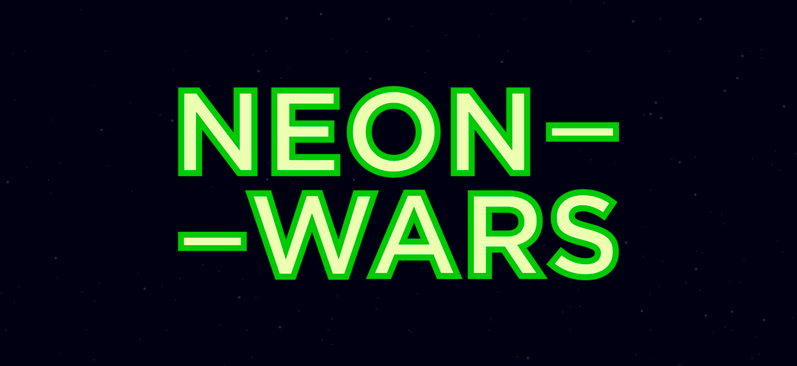
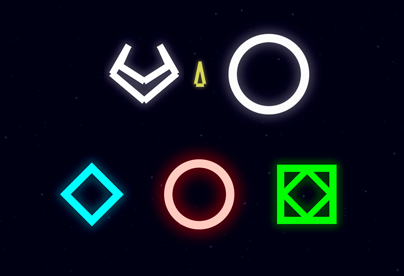

 ## Enjoy Now!
-   [OSX](https://github.com/antony999k/Neon-Wars/releases/tag/1.0.0)
- ~~[Windows]()~~ (Not Available now)
- ~~[Linux]()~~ (Not Available now)
- ~~[Mobile]()~~ (Not supported)

Geometry Wars Combat Evolved Clone in Unity2D. At the moment the game only can be played with gamepad. The goal is to shoot down as many enemies as possible and have the best score.

## Gameplay

## Some Assets

## Technologies
- Adobe Photoshop
- Unity 2019.3

@Antony999k